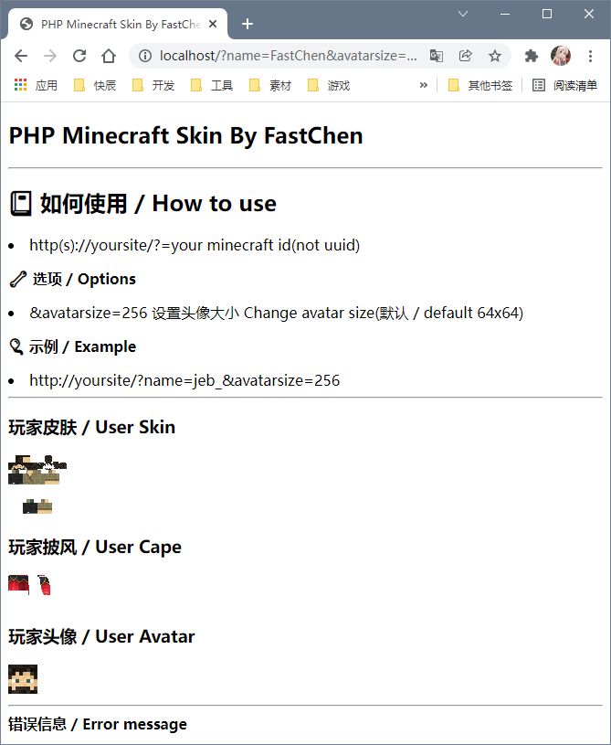

# PHP-Minecraft-Skin
一个简单使用Mojang API 获取玩家皮肤与披风并且通过皮肤生成头像的例子

## 📔 如何使用 / How to use

- http(s)://yoursite/?=your minecraft id(not uuid)

**🔧  选项 / Options**

- &avatarsize=256 设置头像大小 Change avatar size(默认 / default 64x64)

**🎈  示例 / Example**

- http://yoursite/?name=jeb_&avatarsize=256

## 其他信息 / Other info

**💻  其他语言 / Other Programming language**

- [C#-NullCraft-Minecraft-Skin](https://github.com/FastChen/NullCraft-Minecraft-Skin)

**🧾  API使用说明 / API Use**

- [无聊写了个Minecraft皮肤获取，分享一些API](https://fastchen.com/works/minecraftskin.html)

**🖼  图片 / image**

